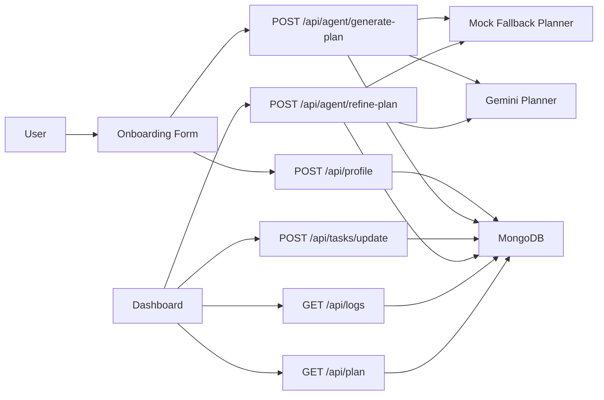

# ArrivalMate AI — Gemini + MongoDB Newcomer Survival Agent

ArrivalMate AI is a hackathon-ready MVP for the Google Cloud Rapid Agent Hackathon and MongoDB partner track. It helps international students, newcomers, workers, and visitors arriving in British Columbia turn first-month uncertainty into a practical 30-day action plan.

The product is built as a full-stack Next.js app with:

- Gemini-powered structured planning
- MongoDB-backed memory for profiles, plans, progress, and agent logs
- Deterministic fallback planning when Gemini is unavailable
- A polished onboarding-to-dashboard demo flow

## Overview

ArrivalMate AI goes beyond a simple chatbot. It acts like a lightweight survival agent for the first 30 days in Canada:

- collects structured newcomer context
- generates a prioritized checklist with deadlines and steps
- warns about common scams and safety risks
- recommends local resources
- stores plans and progress in MongoDB
- refines plans when user circumstances change

## Problem

Newcomers often arrive with too many urgent tasks at once:

- documents
- SIN
- banking
- transit
- housing safety
- school or work setup
- health coverage
- scam prevention

Critical information is scattered, timing is stressful, and bad decisions in the first week can be costly.

## Solution

ArrivalMate AI creates a personalized first-30-days plan for each user based on:

- arrival date
- city
- status
- institution or workplace
- selected needs
- current setup status
- urgency
- notes

It returns:

- urgent tasks
- grouped checklist items for `Today`, `This Week`, and `This Month`
- deadlines and explanations
- scam warnings with safe actions
- local resources
- agent reasoning summary
- progress tracking

## Demo Flow

1. Open `/`
2. Click `Build My Arrival Plan`
3. Complete the onboarding form
4. Generate a personalized plan
5. Review the dashboard
6. Mark tasks complete
7. Refine the plan with a new note
8. Inspect saved plans and agent logs

## Screenshots

Add screenshots before submission:

- `docs/screenshots/landing.png`
- `docs/screenshots/onboarding.png`
- `docs/screenshots/dashboard.png`
- `docs/screenshots/refinement.png`

## Features

- Personalized newcomer checklist
- Gemini-powered structured plan generation
- MongoDB-backed profile, plan, and log persistence
- Deterministic fallback planner when Gemini is unavailable or rate-limited
- Task progress updates with persistence
- Plan regeneration and refinement
- Scam awareness section
- Local resource recommendations
- Agent logs for demo transparency
- Seed script for instant demo data

## Tech Stack

- Frontend: Next.js App Router, TypeScript, Tailwind CSS
- Backend: Next.js Route Handlers
- AI: Gemini via `@google/genai`
- Database: MongoDB Node driver
- Validation: Zod
- Testing: Vitest
- Deployment: Vercel or Google Cloud Run

## Architecture



### App Routes

- `/` landing page
- `/onboarding` onboarding form
- `/dashboard` saved plan and progress dashboard

### API Routes

- `GET /api/profile`
- `POST /api/profile`
- `GET /api/plan`
- `GET /api/logs`
- `POST /api/tasks/update`
- `POST /api/agent/generate-plan`
- `POST /api/agent/refine-plan`

### MongoDB Collections

- `profiles`
- `plans`
- `agent_logs`

Tasks are embedded in each plan document.

## Gemini Agent Design

The Gemini agent is intentionally structured for hackathon judging:

- JSON-only output contract
- validation before persistence
- retry on malformed model output
- fallback planner for resilience
- explicit safety framing
- practical, action-oriented task generation

System instruction:

> You are ArrivalMate AI, a practical newcomer support agent for people arriving in British Columbia, Canada. You help international students and newcomers organize their first 30 days after arrival. You do not provide legal, immigration, medical, or financial advice. You create clear, step-by-step action plans, prioritize urgent tasks, identify safety risks, and help the user track progress. You are action-oriented and return structured JSON only.

## MongoDB Partner Track / MCP Integration

MongoDB is a visible, core part of the project:

- stores onboarding profiles
- stores plan snapshots
- stores task completion progress
- stores agent logs

Judges can inspect project state directly through MongoDB and MCP tooling.

Example config is included in:

- [mcp/mongodb-mcp-config.example.json](./mcp/mongodb-mcp-config.example.json)

### MCP Setup

1. Provision a MongoDB Atlas cluster
2. Create a database user with read/write access
3. Copy `mcp/mongodb-mcp-config.example.json` into your MCP client config
4. Replace the placeholder connection string
5. Start the MCP server from your AI tool or MCP-compatible client

### Example MCP Prompts

- `Show all saved newcomer plans.`
- `Find high priority tasks for users in Surrey.`
- `Summarize scam warnings generated by the agent.`
- `Show agent logs for the latest profile.`

## Local Setup

### Prerequisites

- Node.js 20+
- npm 10+
- MongoDB Atlas URI or local MongoDB instance
- Gemini API key for live planning

### Install

```bash
npm install
```

### Environment

Copy `.env.example` to `.env.local`:

```bash
GEMINI_API_KEY=
MONGODB_URI=
MONGODB_DB=arrivalmate
NEXT_PUBLIC_APP_URL=http://localhost:3000
```

### Run

```bash
npm run dev
```

Open:

- [http://localhost:3000](http://localhost:3000)

### Seed Demo Data

```bash
npm run seed
```

This creates a demo profile, plan, and agent log in MongoDB.

## Environment Variables

- `GEMINI_API_KEY`
  Used for Gemini plan generation and refinement.

- `MONGODB_URI`
  Required for MongoDB persistence.

- `MONGODB_DB`
  Defaults to `arrivalmate`.

- `NEXT_PUBLIC_APP_URL`
  Base application URL for local/dev deployment contexts.

`.env.local` is for local development only and should never be pushed to GitHub.

## Testing

Run:

```bash
npm test
```

Current automated coverage includes:

- mock fallback generation
- plan schema validation
- progress calculation
- task completion state updates
- invalid profile API payload handling
- invalid task update payload handling

## MongoDB Atlas Setup

1. Create a free MongoDB Atlas cluster.
2. Create a database user with read/write access.
3. Add a network access rule for your current IP or deployment environment.
4. Copy the Atlas connection string.
5. Set `MONGODB_URI` in `.env.local` and in your Vercel project settings.
6. Set `MONGODB_DB=arrivalmate`.
7. Run the app or `npm run seed` once to create collections automatically.

Collections are created automatically after first use or seed:

- `profiles`
- `plans`
- `agent_logs`

## Gemini Setup

1. Create or retrieve a Gemini API key from Google AI Studio.
2. Set `GEMINI_API_KEY` in `.env.local`.
3. Add the same key to your Vercel environment variables.
4. If Gemini quota is unavailable, ArrivalMate AI automatically switches to resilient demo mode.
5. Technical fallback reasons remain visible in agent logs for debugging, not in the main UI.

## Deployment

### Vercel

```bash
npm run build
npx vercel --prod
```

Set these env vars in the Vercel dashboard:

- `MONGODB_URI`
- `MONGODB_DB=arrivalmate`
- `GEMINI_API_KEY`
- `NEXT_PUBLIC_APP_URL=https://your-vercel-url.vercel.app`

Deployment notes:

- `MONGODB_URI` is required for persistence.
- If Gemini quota is exhausted, the app still works in resilient demo mode.
- Never commit `.env.local` or any real keys to GitHub.

### Google Cloud Run

```bash
npm run build
gcloud builds submit --tag gcr.io/YOUR_GCP_PROJECT/arrivalmate-ai
gcloud run deploy arrivalmate-ai --image gcr.io/YOUR_GCP_PROJECT/arrivalmate-ai --platform managed --region us-central1 --allow-unauthenticated --set-env-vars NEXT_PUBLIC_APP_URL=https://YOUR_CLOUD_RUN_URL,MONGODB_DB=arrivalmate --set-secrets GEMINI_API_KEY=GEMINI_API_KEY:latest,MONGODB_URI=MONGODB_URI:latest
```

Project includes:

- `Dockerfile`
- standalone Next.js build output support

## Demo Recording Checklist

### Before recording

- Run `npm run seed` or create a clean demo profile.
- Open the deployed app.
- Test the onboarding flow once before recording.
- Keep a MongoDB Atlas tab ready if you want to show collections or logs.
- Use a realistic student or newcomer example for the walkthrough.

### 3-minute demo flow

- `0:00–0:20` Problem
- `0:20–0:40` Solution overview
- `0:40–1:20` Onboarding form
- `1:20–1:50` Generated action plan
- `1:50–2:15` Task progress and MongoDB memory/logs
- `2:15–2:40` Refine plan
- `2:40–3:00` Impact and tech stack

## Devpost Submission Draft

### Title

ArrivalMate AI

### Tagline

A Gemini + MongoDB newcomer survival agent for the first 30 days in Canada.

### Short Description

ArrivalMate AI helps newcomers and international students arriving in British Columbia turn scattered first-month setup tasks into a personalized action plan. It uses Gemini-style agent planning, MongoDB-backed memory, progress tracking, scam warnings, and plan refinement to help users organize documents, transit, banking, housing safety, school or work setup, and local support.

### Built With

- Next.js
- TypeScript
- Tailwind CSS
- Gemini API
- MongoDB Atlas
- MongoDB MCP configuration
- Vercel
- Google Cloud Run

### Track

MongoDB

## Hackathon Submission Notes

Why this project is strong for judging:

- clear AI agent behavior, not simple chat
- Gemini integration is visible and testable
- MongoDB usage is persistent and inspectable
- fallback behavior makes demos resilient
- onboarding-to-dashboard flow is easy to understand
- saved plans and agent logs make the system believable

## Future Improvements

- multi-user auth
- city-specific official resource links
- richer end-to-end test coverage
- multilingual onboarding
- calendar export
- notifications and reminders

## License

MIT
